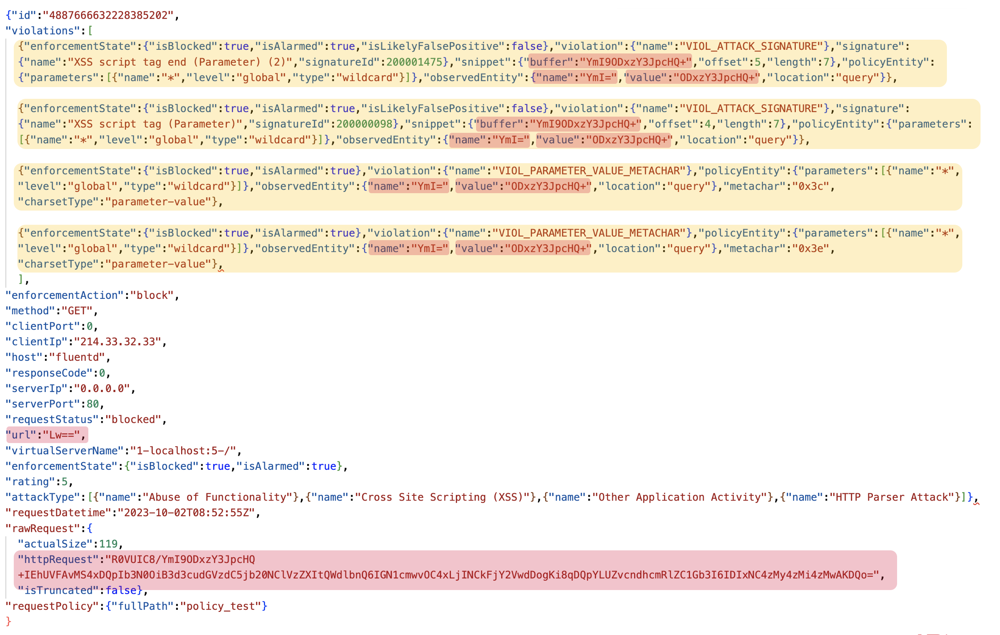
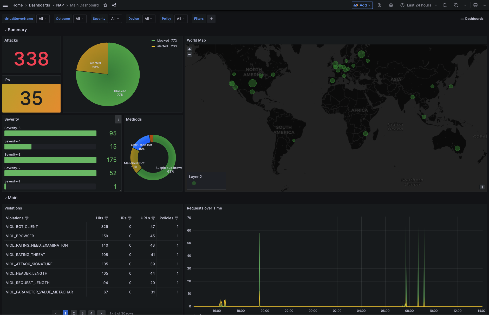
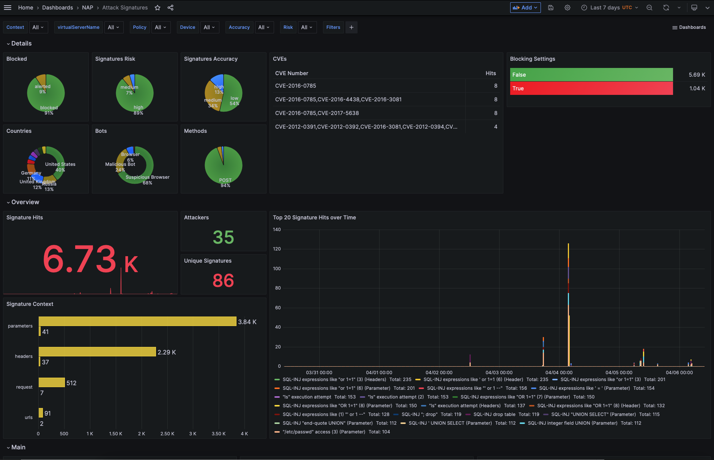
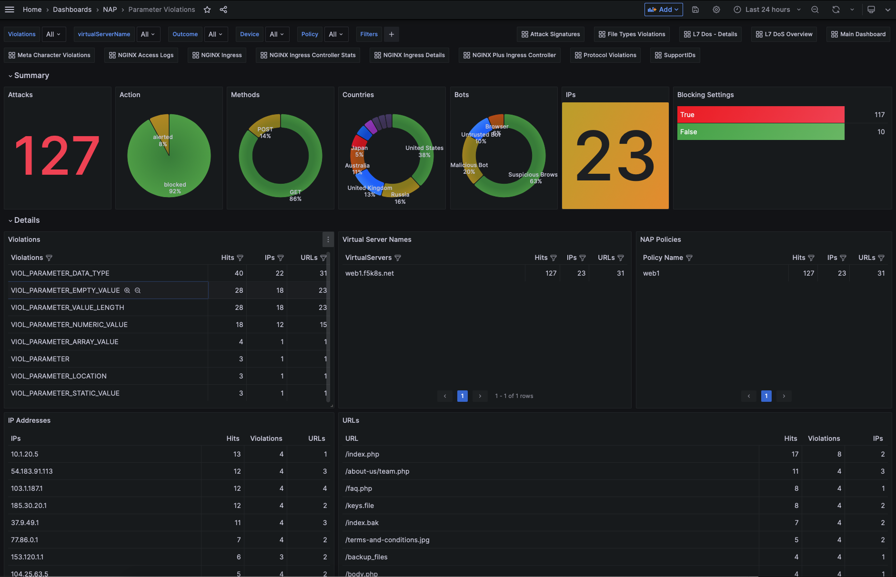
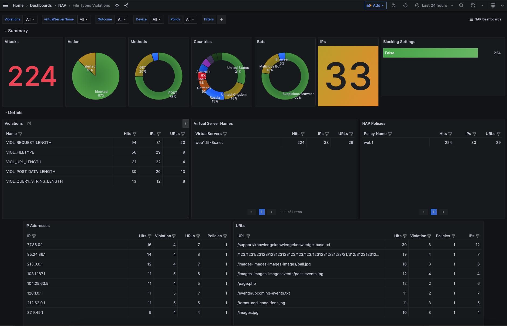
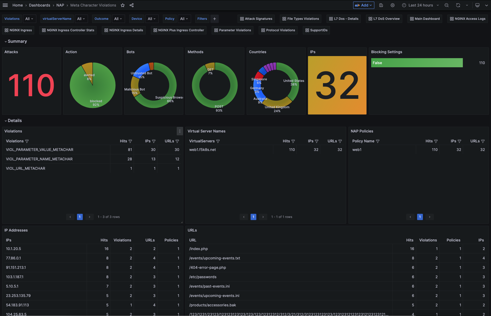
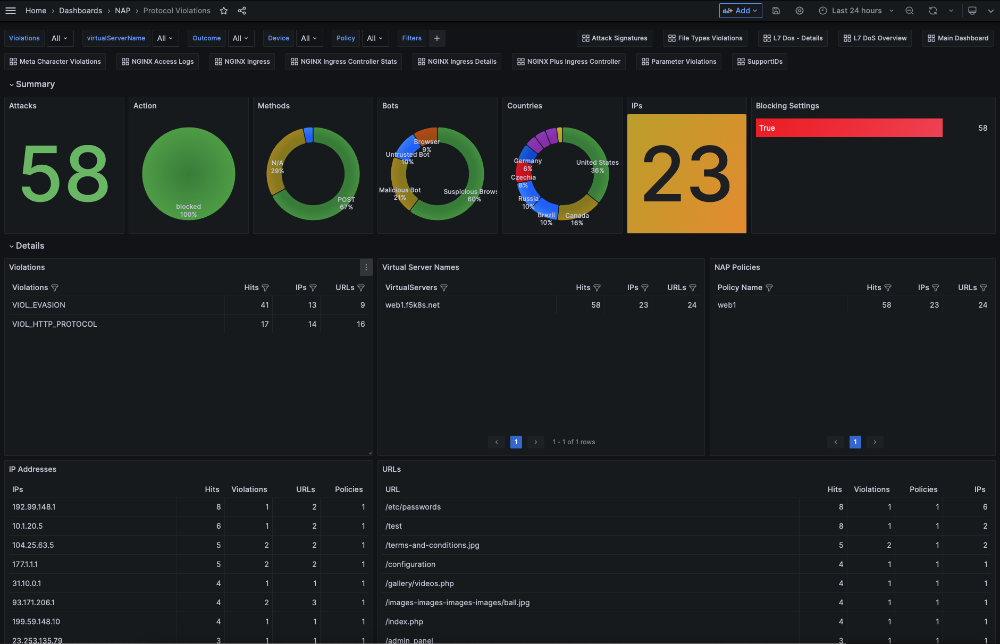
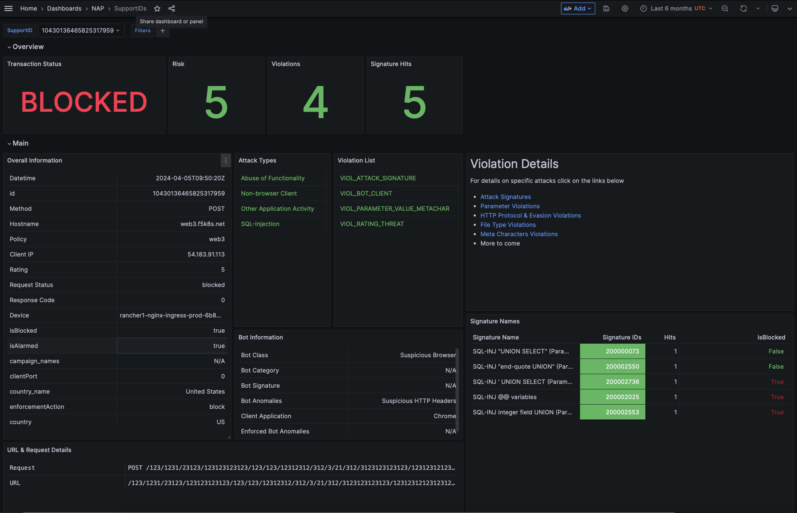

# NGINX APP Protect (NAP) Dashboard
This project simplifies your SecOps team's workflow with the NGINX APP Protect (NAP) Dashboard, leveraging Grafana Dashboards for streamlined review and analysis of violations.

<p align="center">

</p>

The solution employs an ingestion solution (**FluentD** or **Logstash**) for seamless log ingestion from NAP instances, transforming the data, and storing it in Elasticsearch indexes. Grafana acts as the analytics platform, connecting to Elasticsearch as the datasource and offering interactive dashboards.

In the following sections we will cover the following:

 - [Transforming NAP logs](transforming-nap-logs) 
 - [Dashboards](dashboards)
 - [Installation](installation)

## Transforming NAP logs
Starting with NAP release 4.3, the **json_log** field includes the Violation details formatted in JSON. While json_log doesnt provide yet the details for all violation types, it makes it significant easier and faster to parse NAP logs compared to the key/value pairs and the XML violation details.
Moreover, with each release, more violations are incorporated into the **json_log** field, making it the preferred method for logging violation details.

To check which violations are currently supported with **json_log** field please click [here](supported_violations.md) 

Below, we outline the contents of the json_log field. Take a closer look on the following variables; `url`, `rawRequest.httpRequest` and the `violations`.

<p align="center">

</p>

The `url` and `rawRequest.httpRequest` are Base64 encoded, while `violations` presents an array with each violation recorded on the transaction.

With the use of Logstash or FluentD we perform the following transformations:
- Base64 decoding for `url` and `rawRequest.httpRequest`
- Enriching the log with the GeoIP point of the SourceIP
- Create separate logs for each item in the `violations` array.
- Base64 decode the entries within the `violations` array.

> **Note**: Until Bot logs are incorporated into **json_log**, we have manually included them as additional JSON key/value pairs that we are extracting manually.

We offer two options for log ingestion/transformation: **FluentD** or **Logstash**, each supported by configuration examples to suit your preference and environment. For Logstash, we provide configuration examples tailored for Docker environments, whereas for FluentD, we offer configuration examples optimized for Kubernetes setups. Choose the option that best aligns with your infrastructure and requirements.


## NAP Dashboards
The Dashboards that we have created so far are:
- [Main](#main-dashboard)
- [Attack Signatures](#attack-signatures)
- [Parameter Violations](#parameters-violations)
- [File Types Violations](#filetype-violations)
- [Protocol Violations ](#protocol-violations)
- [Meta Character Violations](#meta-character-violations)
- [Header Violations](#header-violations)
- [Cookie Violations](#cookie-violations)
- [SupportID](#supportid)


### Main Dashboad
This is the main dashboard that provides an overview of all the violations that have been logged by NGINX App Protect WAF. From this table you can navigate to the other dashboards like SupportID, Attack-Signatures, Parameter Violations, by clicking on the links at the top right corner. Some of the graphs/tables included in this dashboard are:
- Attacks recorded and mitigated
- Violation categories
- Attacks over time
- Mitigated Bots 
- GeoMap
- Attacks per URL/IP
- Attack Signature detected
- Attacks per VirtualServer and Policy
- Bot Categories and Signatures
- Bot Class and Anomalies
- CVEs and Threat Campaigns
- Logs

<p align="center">

</p>

For more screenshots click [here](dashboards/main.md)

### Attack Signatures
The Attack Signature dashboard provides details for all the signatures that triggered the `VIOL_ATTACK_SIGNATURE` violation

<p align="center">

</p>

For more screenshots click [here](dashboards/attack_signature.md)


### Parameter Violations
The Parameter Dashboard provides details for all **parameter** related violations including `VIOL_PARAMETER`, `VIOL_PARAMETER_ARRAY_VALUE`,`VIOL_PARAMETER_DATA_TYPE`,`VIOL_PARAMETER_EMPTY_VALUE`,`VIOL_PARAMETER_LOCATION`,`VIOL_PARAMETER_NUMERIC_VALUE`,`VIOL_PARAMETER_STATIC_VALUE`,`VIOL_PARAMETER_VALUE_LENGTH`

<p align="center">

</p>

For more screenshots go click [here](dashboards/parameter_violations.md)

### FileType Violations
The FileType Dashboard provides details for all the file type related violations including `VIOL_FILETYPE`, `VIOL_POST_DATA_LENGTH`,`VIOL_QUERY_STRING_LENGTH`,`VIOL_REQUEST_LENGTH`,`VIOL_URL_LENGTH`. 

<p align="center">

</p>

For more screenshots click [here](dashboards/filetype_violations.md)


### Meta-Character Violations
The Meta-Character Violations Dashboard provides details for all the meta-character related violations including `VIOL_PARAMETER_VALUE_METACHAR`, `VIOL_PARAMETER_NAME_METACHAR`, `VIOL_PARAMETER_URL_METACHAR`.

<p align="center">

</p>

For more screenshots click [Hhere](dashboards/metacharacter_violations.md)


### Protocol Violations
The Protocol Dashboard provides details for all the protocol related violations including `VIOL_HTTP_PROTOCOL`, `VIOL_EVASION`.

<p align="center">

</p>

For more screenshots click [here](dashboards/protocol_violations.md)


### SupportID Dashboard
The SupportID Dashboard provides details for a specific transaction (SupportID) that was logged by NGINX App Protect WAF. These include the following:
- Client/Server Information (Client IP/Port, Server IP/Port, X-Forwared-For, etc)
- Violation Details (Outcome, Request Status, Outcome Reson, etc)
- Bot Details (Bot Classm Bot Category, Bit Signature, etc)
- Device Details (NAP Device name, Vritual Server Name)
- Signatures Triggered
- Treat Campaign triggered
- Violation list
- Many more

<p align="center">
  
</p>

For more screenshots click [Here](dashboards/support_id.md)


## Installation

To run this Dashboard you will need to deploy the following open source solutions:
- Logstash (or FluentD)
- Elasticsearch 
- Grafana
- Docker
- Docker Compose

Steps will be provided on how to deploy all of the software in a Docker environment using Docker Compose. It is assumed that Docker and Docker Compose are already installed and configured on the system.
While we will provide the installation details for Logstash by default, at the end of the section we will provide details on how to use FluentD instead of Logstash.

### Clone the repo

Clone this repo to your local machine using `https://github.com/skenderidis/nap-dashboard` and switch the working directory to be `nap-policy-management/dashboard`

```shell
git clone https://github.com/skenderidis/nap-dashboard
cd nap-dashboard
```


### Install Logstash-Elasticsearch-Kibana-Grafana using docker-compose

```shell
TZ=Asia/Dubai && docker-compose up -d
```

***NOTES:***
>  - Logstash is configured on port 8515. Please use this port to send the logs from NGINX App Protect.
>  - Change the timezone used in the docker containers by altering the inline environment variable in the command above accordingly to your location. A list of TZ Database Names can be found [here](https://en.wikipedia.org/wiki/List_of_tz_database_time_zones).


### Configure Elasticsearch
>  In you are not running the following commands from your docker host, please change `localhost` to the hostname or IP address of your docker host.

1. Create index template for the NAP Logs
```shell
curl -d "@elastic/index-template-waf.json" -H 'Content-Type: application/json' -X PUT 'http://localhost:9200/_index_template/nginx-nap-logs'
```
Expected Response: `{"acknowledged":true}`


### Configure Grafana
1. Setup Grafana sources 
```shell
curl -d "@grafana/DS-waf-index.json" -H 'Content-Type: application/json' -u 'admin:admin' -X POST 'http://localhost:3000/api/datasources/'
curl -d "@grafana/DS-waf-decoded-index.json" -H 'Content-Type: application/json' -u 'admin:admin' -X POST 'http://localhost:3000/api/datasources/'
```

2. Deploy Grafana Dashboards.

To deploy the Grafana Dashboards goto `Import Dashboard` and input the Dashboard ID (as per the following table) on `Import via grafana.com` tab. 
<p align="center">
       
</p>

| Dashboard Name                        | Dashboard ID  |  Grafana Source        |   Grafana Website                                                  | 
| -------------                         | :---:         |-------------           |  :---:                                                             | 
| Main Dashboard                        | 20052         | WAF-Logs               | <a href="https://grafana.com/grafana/dashboards/20052"> Link </a>  |
| SupportIDs                            | 20055         | WAF-Logs , WAF-Decoded | <a href="https://grafana.com/grafana/dashboards/20055"> Link </a>  |
| Attack Signatures                     | 20048         | WAF-Decoded            | <a href="https://grafana.com/grafana/dashboards/20048"> Link </a>  |
| File Types                            | 20049         | WAF-Logs               | <a href="https://grafana.com/grafana/dashboards/20049"> Link </a>  |
| Meta Characters                       | 20053         | WAF-Logs               | <a href="https://grafana.com/grafana/dashboards/20053"> Link </a>  |
| Parameters                            | 20054         | WAF-Logs               | <a href="https://grafana.com/grafana/dashboards/20054"> Link </a>  |
| Protocol                              | 20892         | WAF-Logs               | <a href="https://grafana.com/grafana/dashboards/20892"> Link </a>  |


### Configure Logging profile for NAP

For NAP working on an Ingress please configure the following logging format 
```yaml
apiVersion: appprotect.f5.com/v1beta1
kind: APLogConf
metadata:
  name: logconf
spec:
  content:
    format: user-defined
    format_string: "{\"campaign_names\":\"%threat_campaign_names%\",\"bot_signature_name\":\"%bot_signature_name%\",\"bot_category\":\"%bot_category%\",\"bot_anomalies\":\"%bot_anomalies%\",\"enforced_bot_anomalies\":\"%enforced_bot_anomalies%\",\"client_class\":\"%client_class%\",\"client_application\":\"%client_application%\",\"json_log\":%json_log%}"
    max_message_size: 30k
    max_request_size: "500"
    escaping_characters:
    - from: "%22%22"
      to: "%22"
  filter:
    request_type: illegal
```

For NAP working on a Docker or on a VM implementation, please configure the following logging format

```json
{
    "filter": {
        "request_type": "illegal"
    },
  
    "content": {
        "format": "user-defined",
        "format_string": "{\"campaign_names\":\"%threat_campaign_names%\",\"bot_signature_name\":\"%bot_signature_name%\",\"bot_category\":\"%bot_category%\",\"bot_anomalies\":\"%bot_anomalies%\",\"enforced_bot_anomalies\":\"%enforced_bot_anomalies%\",\"client_class\":\"%client_class%\",\"client_application\":\"%client_application%\",\"json_log\":%json_log%}", 
        "max_request_size": "500",
        "max_message_size": "30k",
        "escaping_characters": [
         {
            "from": "%22%22",
            "to": "%22"
         }  
      ]      
    }
  }
  ```


### Using FluentD instead of Logstash

1. Remove the logstash from the docker-compose file to save some resources.

2. Go to the fluentd folder of the repo and deploy the services below
```shell
kubectl apply -f ns-sa.yaml
kubectl apply -f configmap.yaml
kubectl apply -f deployment.yaml
kubectl apply -f service.yaml
```

3. Point your nap instance to the fluentd service that runs inside your kubernetes environment. It should be similar to **fluentd-svc.fluentd:8515**

4. **(optional)** Create your own FluentD image
Currently the existing image `skenderidis/nap-fluentd` has been created based on the instructions from the official FluentD repo (
https://github.com/fluent/fluentd-kubernetes-daemonset/blob/master/docker-image/v1.16/debian-elasticsearch8/Dockerfile) and we have added 3 additional plugins:
- **`fluent-plugin-geoip`** that will enrich the GeoIP based on the client's source IP
- **`fluent-plugin-nginx-nap-split`** that will split the violations array into multiple entries
- **`fluent-plugin-nginx-nap-decode`** that will base64 decode the values within each violation

If you want to build your own image from scratch, then follow the instructions from the FluentD repo
(https://github.com/fluent/fluentd-kubernetes-daemonset/blob/master/docker-image/v1.16/debian-elasticsearch8/Dockerfile) 
on how to create a FluentD image. 

For your reference below you can find the Dockerfile and Gemfile that have been used for creating the current image.
- [DockerFile](https://github.com/skenderidis/docker-images/blob/main/fuentd/Dockerfile)
- [Gemfile](https://github.com/skenderidis/docker-images/blob/main/fuentd/Gemfile)


