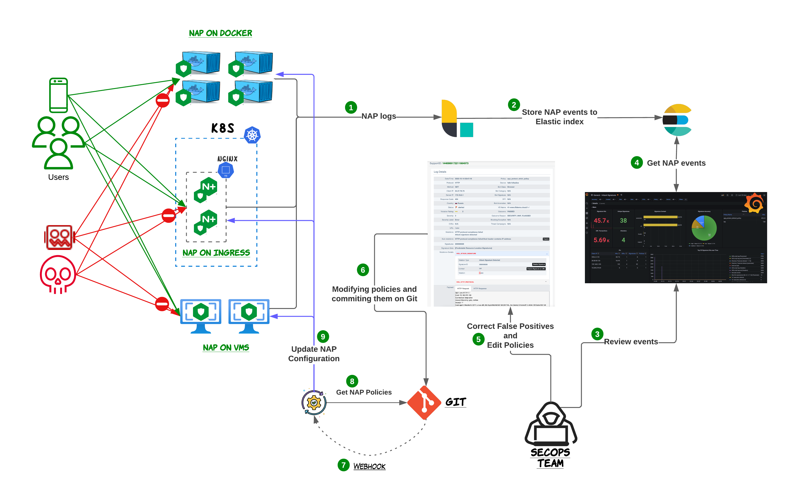
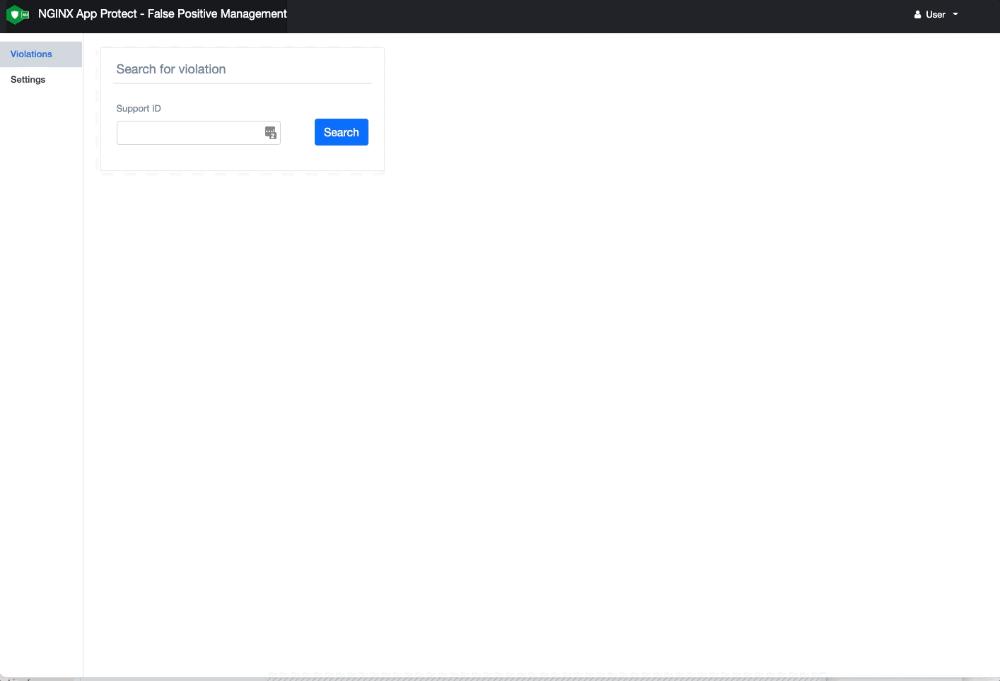

## **Important Note:** This project has been archieved and moved to: https://github.com/f5devcentral/nap-policy-management

# NAP - Policy Management
This project makes it easier for SecOps teams to manage NGINX APP Protect (NAP) violations and policies through a UI.
NAP Policy Management (NPM) can assist the SecOps teams by providing the following functionalities:
- [Storing and visualizing NAP violations](#nap-dashboard)
- [Managing False Positives](#nap-false-positive-management)
- [Policy editor for both YAML/JSON NAP policies](#nap-policy-editor)

## Overall Architecture
The following diagram shows a high level architecture of the typical lifecycle of the NGINX NAP policies and how the different technologies work together.

Steps:
1) NAP instances running on Kubernetes/Docker/VMs are configured to send their logs to FluentD.
2) FluentD tranforms the logs it ingests and store them on Elasticsearch indexes.
3) SecOps teams use the Grafana dashboards to get a consolidated view of all the NAP events, identifying possible threats and false positives.  
4) Grafana queries Elasticsearch for the relevant data that are visualized on its dashboards.
5) SecOps use the Policy Management tool and edit their NAP policies either manual or through the blocked/alarmed events.
6) The Policy Management tool will reflect the chages made by the SecOps team to the JSON/YAML policies stored on Git repository.
7) Git notifies the CI/CD tool about the changes on the repository files.
8) CI/CD tool will get a copy of the new policies and execute the relevant pipeline
9) Upon the successfull completion of the pipeline, the new configuration will be pushed on the NGINX NAP instances.    

## NAP Dashboard
NAP Dashboard is where the the users can go and review all the violations that have been generated by NAP instances. 
The solution uses Logstash to ingest the logs from NAP instances, transforms them and finally store them in Elasticsearch indexes. Grafana is used as the analytics platform that connects to the datasource (Elasticsearch) and provides interactive dashboards.

> More information on how to install and use the NAP Dashboard can be found [here](dashboard/)

Few of the dashboards that have been already created are:
- [Overview](#overview)
- [Attack Signatures](#attack-signatures)
- [Bots](#bots)
- [SupportID](#supportid)

#### Overview
This is the main dashboard that provides an overview of all the violations that have been logged by NGINX App Protect WAF. From this table you can navigate to the other dashboards like SupportID, by clicking on the links. Some of the graphs/tables included in this dashboard are:
- Attacks recorded and mitigated
- Violation categories
- Attacks over time
- Mitigated Bots 
- GeoMap
- Attacks per URL
- Attack Signature detected
- Bot activity per IP/Country
- Bot activity per Policy/Device
- CVEs and Threat Campaigns
- Logs

#### Attack Signatures
The Attack Signature dashboard provides details for all the signatures that were triggered by NGINX App Protect WAF. Some of the graphs/tables included in this dashboard are:
- Signature Hits
- Signature Accuracy and Risk
- Signatures per Context 
- Signature details 
- Signatures per URL/IP/Policy
- Parameter Names and Values
- Header Names and Values
- Cookies Names and Values
- Logs

#### Bots
The Bot Dashboard provides details for all the Bot activity that was logged by NGINX App Protect WAF. Some of the graphs/tables included in this dashboard are:
- Bot Types
- Bot Categories
- Bot Activity over time
- Mitigated Bots 
- Bot activity per URL
- Bot activity per IP/Country
- Bot activity per Policy/Device
- Logs

#### SupportID Dashboard
The SupportID Dashboard provides details for a specific transaction (SupportID) that was logged by NGINX App Protect WAF. These include the following:
- Client/Server Information (Client IP/Port, Server IP/Port, X-Forwared-For, etc)
- Violation Details (Outcome, Request Status, Outcome Reson, etc)
- Bot Details (Bot Classm Bot Category, Bit Signature, etc)
- Device Details (NAP Device name, Vritual Server Name)
- Signatures Triggered
- Treat Campaign triggered
- Violation list
- Many more

  

## NAP False Positive Management
This project has a simple UI build on PHP, that retrieves the violation log from Elasticsearch based on the SupportID requested and presents the user the summary of the event.
Depending on the violations that were identified on the NAP log, the tool provides the user predefined actions for disabling these violations. For example, as seen on the above picture, `Disable Signature` or `Disable Signature on URL`.
Once the user confirms the details and the tool is configured to pull the current policy from GitLab, make the required changes on the policy’s YAML/JSON file and save it back to GitLab.

  

> More information on how to install and use the NAP False Positive Management (FPM) can be found [here](npm/)

NAP FPM provides predefined actions for the following violations:
- Evasions
- HTTP Compliance
- Attack Singatures
- Bot Classes
- Bot Signatures
- Files Types
- Extensions Length
- Metacharacters
- Cookie Length
- HTTP Length
- Encoding
- Header Repeated
- Mandatory Header
- Mandatory Parameter
- Illegal Method
- Illegal Response Code
- Many many more ...

## NAP Policy Editor
Similar to FPM, the policy editor project provides a simple UI, build also on PHP, that retrieves NAP policies from Git repositories, analyzes them and presents them back to the user providing visibility on all the settings/features/violations that have been enabled by each policy. 
The user can navigate through the different configuration sections of the policy and make the desired changes to them. The changes are parsed through the configuration analyzer and once successfull, are pushed back to the original Git repository.

  

> More information on how to install and use the NAP Policy Editor can be found [here](npm/)

---

## Support

For support, please open a GitHub issue. Note, the code in this repository is community supported and is not supported by F5 Networks.

### Community Code of Conduct
Please refer to the [F5 DevCentral Community Code of Conduct](code_of_conduct.md).

### License
[Apache License 2.0](LICENSE)

### Copyright
Copyright 2014-2023 F5 Networks Inc.
 

### F5 Networks Contributor License Agreement

Before you start contributing to any project sponsored by F5 Networks, Inc. (F5) on GitHub, you will need to sign a Contributor License Agreement (CLA).

If you are signing as an individual, we recommend that you talk to your employer (if applicable) before signing the CLA since some employment agreements may have restrictions on your contributions to other projects.
Otherwise by submitting a CLA you represent that you are legally entitled to grant the licenses recited therein.

If your employer has rights to intellectual property that you create, such as your contributions, you represent that you have received permission to make contributions on behalf of that employer, that your employer has waived such rights for your contributions, or that your employer has executed a separate CLA with F5.

If you are signing on behalf of a company, you represent that you are legally entitled to grant the license recited therein.

You represent further that each employee of the entity that submits contributions is authorized to submit such contributions on behalf of the entity pursuant to the CLA.
