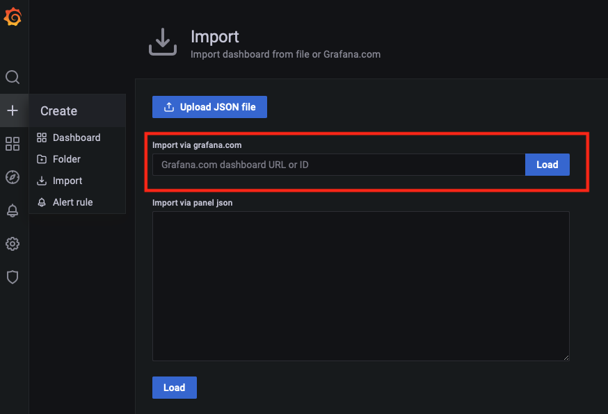

# NAP Dashboard - Installation

To run this Dashboard you will need to deploy following open source solutions. 
- Logstash
- Elasticsearch 
- Grafana
- Docker
- Docker Compose
- Python 3.7+

Steps will be provided on how to deploy all of the software in a Docker environment using Docker Compose. It is assumed that Docker and Python 3.7+ is already installed and configured on the system.

### Clone the repo

Clone this repo to your local machine using `https://github.com/f5devcentral/nap-policy-management` and switch the working directory to be `nap-policy-management/dashboard`

```shell
git clone https://github.com/f5devcentral/nap-policy-management
cd nap-policy-management/dashboard
```

### Install Elasticsearch-Logstash using docker-compose

```shell

TZ=Asia/Dubai && docker-compose up -d

```
NOTES:
>  - Change the timezone used in the docker containers by altering the inline environment variable in the command above accordingly to your location. A list of TZ Database Names can be found [here](https://en.wikipedia.org/wiki/List_of_tz_database_time_zones).
>  - The TCP port that Logstash is listening to is 8515.


### Configure Elasticsearch
>  In you are not running the following commands from your docker host, please change `localhost` to the hostname or IP address of your docker host.

1. Create signature index on Elasticsearch
```shell
curl -X PUT 'http://localhost:9200/signatures/'
```
Expected Response: `{"acknowledged":true,"shards_acknowledged":true,"index":"signatures"}`

2. Create index mapping for signature index
```shell
curl -d "@elastic/signature-mapping.json" -H 'Content-Type: application/json' -X PUT 'http://localhost:9200/signatures/_mapping/'
```
Expected Response: `{"acknowledged":true}`

3. Populate the signature index with the data extracted from NGINX signature report tool. You can repeat this process to update the signatures. 
In order to enrich the logs that Elasticsearch is receiving from NAP with information such as signature accuracy, risk, cve, systems affected, etc we need to extract the signatures from NAP (by using NGINX attack signature report tool) and import them into Elasticsearch. More info on NGINX signature report tool can be found <a href="https://docs.nginx.com/nginx-app-protect/configuration-guide/configuration/#attack-signature-report-tool" target="_blank">here</a>.
Otherwise you can use the `signature-report.json` file that can be found on the `signatures` folder and contains the latest signatures.

```shell
python3 signatures/upload-signatures.py signatures/signatures-report.json localhost
```
If successful it will take around 1 min to push all signatures to elastic. Expect to see multiple responses of the following: `{"_index":"signatures","_type":"_doc","_id":"200000001","_version":1,"result":"created","_shards":{"total":2,"successful":1,"failed":0},"_seq_no":7553,"_primary_term":1}`


4. Create template for NAP indexes Index Mapping
```shell
curl -d "@elastic/template-mapping.json" -H 'Content-Type: application/json' -X PUT 'http://localhost:9200/_template/waf_template?include_type_name'
```
Expected Response: `{"acknowledged":true}`


5. Create enrich policy for the NAP/Signatures Indices.
```shell
curl -d "@elastic/enrich-policy.json" -H 'Content-Type: application/json' -X PUT 'http://localhost:9200/_enrich/policy/signatures-policy'
```
Expected Response: `{"acknowledged":true}`

6. Deploy enrich policy.
```shell
curl -X POST 'http://localhost:9200/_enrich/policy/signatures-policy/_execute'
```
Expected Response: `{"status":{"phase":"COMPLETE"}}`

7. Create Ingest Pipeline.
```shell
curl -d "@elastic/sig-lookup.json" -H 'Content-Type: application/json' -X PUT 'http://localhost:9200/_ingest/pipeline/sig_lookup'
```
Expected Response: `{"acknowledged":true}`


### Configure Grafana
1. Setup Grafana source - Elastic WAF Index.
```shell
curl -d "@grafana/DS-waf-index.json" -H 'Content-Type: application/json' -u 'admin:admin' -X POST 'http://localhost:3000/api/datasources/'
```

2. Setup Grafana source - Elastic WAF Decoded Index.
```shell
curl -d "@grafana/DS-waf-decoded-index.json" -H 'Content-Type: application/json' -u 'admin:admin' -X POST 'http://localhost:3000/api/datasources/'
```

3. Deploy Grafana Dashboards.

To deploy the Grafana Dashboards goto `Import Dashboard` and input the Dashboard ID (as per the following table) on `Import via grafana.com` tab. 
<p align="center">
       
</p>

| Dashboard Name                        | Dashboard ID  |  Grafana Source        |   Grafana Website                                                  | 
| -------------                         | :---:         |-------------           |  :---:                                                             | 
| NGINX NAP Main Dashboard              | 15675         | WAF-Logs               | <a href="https://grafana.com/grafana/dashboards/15675"> Link </a>  |
| NGINX NAP Support-ID Dashboard        | 15676         | WAF-Logs , WAF-Decoded | <a href="https://grafana.com/grafana/dashboards/15676"> Link </a>  |
| NGINX NAP Attack Signatures Dashboard | 15677         | WAF-Decoded            | <a href="https://grafana.com/grafana/dashboards/15677"> Link </a>  |
| NGINX NAP BOT Dashboard               | 15678         | WAF-Logs               | <a href="https://grafana.com/grafana/dashboards/15678"> Link </a>  |


### Configure Logging profile for NAP

For NAP working on a Docker or on a VM implementation, please configure the following logging format 
```json
{
    "filter": {
        "request_type": "illegal"
    },
  
    "content": {
        "format": "user-defined",
        "format_string": ",date_time=\"%date_time%\",is_truncated=\"%is_truncated%\",ip_client=\"%ip_client%\",src_port=\"%src_port%\",vs_name=\"%vs_name%\",dest_port=\"%dest_port%\",attack_type=\"%attack_type%\",json_log=\"%json_log%\",blocking_exception_reason=\"%blocking_exception_reason%\",method=\"%method%\",policy_name=\"%policy_name%\",protocol=\"%protocol%\",request_status=\"%request_status%\",response_code=\"%response_code%\",severity=\"%severity%\",sig_cves=\"%sig_cves%\",sig_ids=\"%sig_ids%\",sig_names=\"%sig_names%\",sig_set_names=\"%sig_set_names%\",sub_violations=\"%sub_violations%\",support_id=\"%support_id%\",threat_campaign_names=\"%threat_campaign_names%\",unit_hostname=\"%unit_hostname%\",uri=\"%uri%\",violation_rating=\"%violation_rating%\",x_forwarded_for_header_value=\"%x_forwarded_for_header_value%\",outcome=\"%outcome%\",outcome_reason=\"%outcome_reason%\",violations=\"%violations%\",violation_details=\"%violation_details%\",bot_signature_name=\"%bot_signature_name%\",bot_category=\"%bot_category%\",bot_anomalies=\"%bot_anomalies%\",enforced_bot_anomalies=\"%enforced_bot_anomalies%\",client_class=\"%client_class%\",client_application=\"%client_application%\",client_application_version=\"%client_application_version%\",request=\"%request%\"", 
        "max_request_size": "any",
        "max_message_size": "10k",
        "escaping_characters": [
         {
            "from": "\"",
            "to": "%22"
         }  
      ]      
    }
  }
```

For NAP working on an Ingress please configure the following logging format 
```yaml
apiVersion: appprotect.f5.com/v1beta1
kind: APLogConf
metadata:
  name: logconf
spec:
  content:
    format: user-defined
    format_string: ",date_time=\"%date_time%\",is_truncated=\"%is_truncated%\",ip_client=\"%ip_client%\",src_port=\"%src_port%\",vs_name=\"%vs_name%\",dest_port=\"%dest_port%\",attack_type=\"%attack_type%\",json_log=\"%json_log%\",blocking_exception_reason=\"%blocking_exception_reason%\",method=\"%method%\",policy_name=\"%policy_name%\",protocol=\"%protocol%\",request_status=\"%request_status%\",response_code=\"%response_code%\",severity=\"%severity%\",sig_cves=\"%sig_cves%\",sig_ids=\"%sig_ids%\",sig_names=\"%sig_names%\",sig_set_names=\"%sig_set_names%\",sub_violations=\"%sub_violations%\",support_id=\"%support_id%\",threat_campaign_names=\"%threat_campaign_names%\",unit_hostname=\"%unit_hostname%\",uri=\"%uri%\",violation_rating=\"%violation_rating%\",x_forwarded_for_header_value=\"%x_forwarded_for_header_value%\",outcome=\"%outcome%\",outcome_reason=\"%outcome_reason%\",violations=\"%violations%\",violation_details=\"%violation_details%\",bot_signature_name=\"%bot_signature_name%\",bot_category=\"%bot_category%\",bot_anomalies=\"%bot_anomalies%\",enforced_bot_anomalies=\"%enforced_bot_anomalies%\",client_class=\"%client_class%\",client_application=\"%client_application%\",client_application_version=\"%client_application_version%\",request=\"%request%\""
    max_message_size: 20k
    max_request_size: any
    escaping_characters:
    - from: "\""
      to: "%22"
  filter:
    request_type: illegal
```

## Support

Please open a GitHub issue for any problem or enhancement you need.

