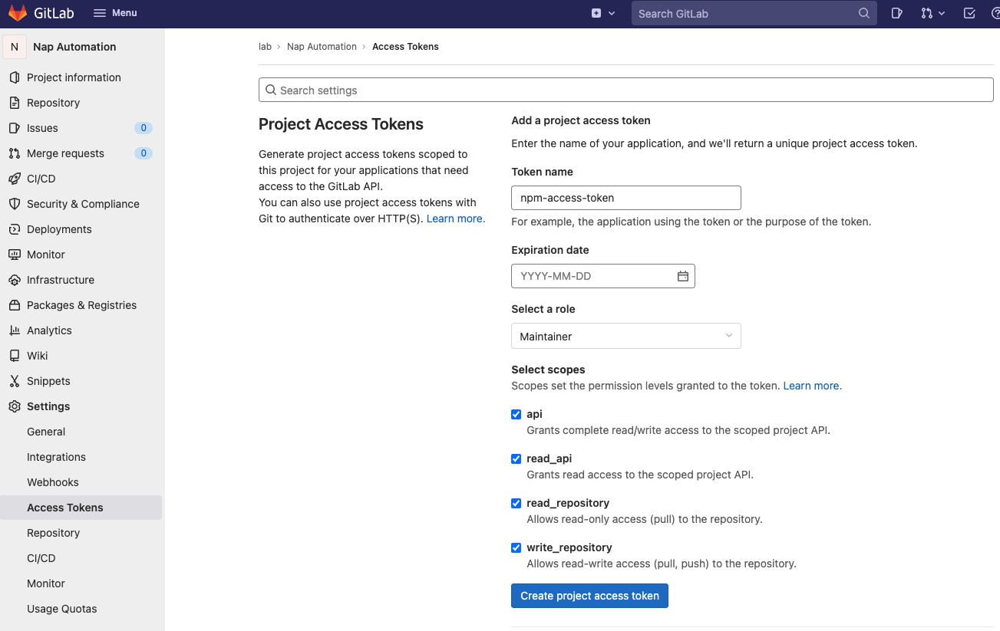
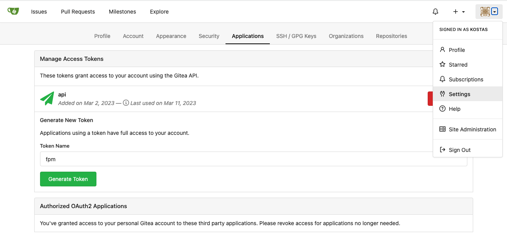
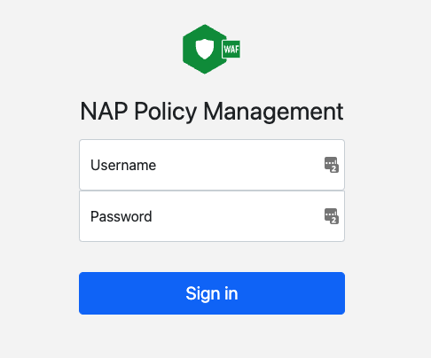
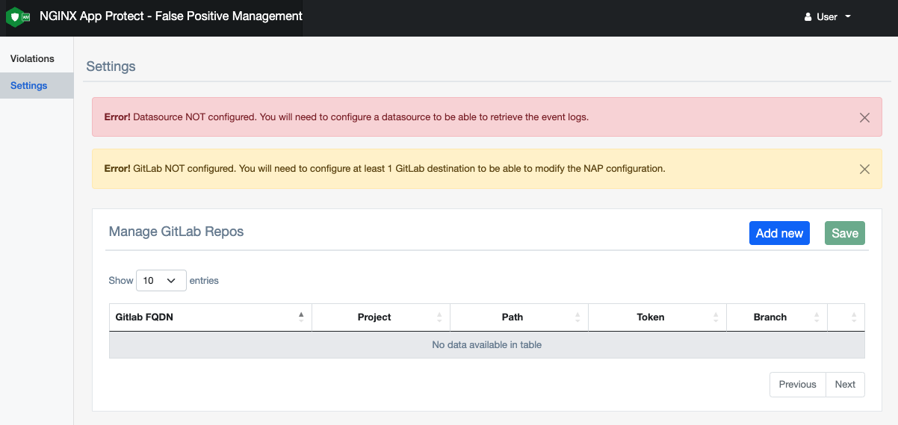
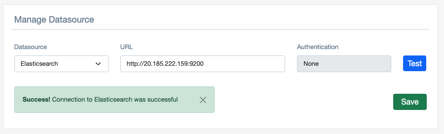
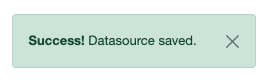
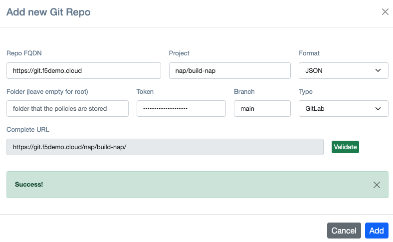
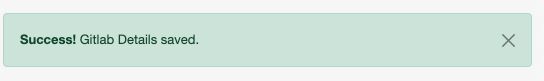
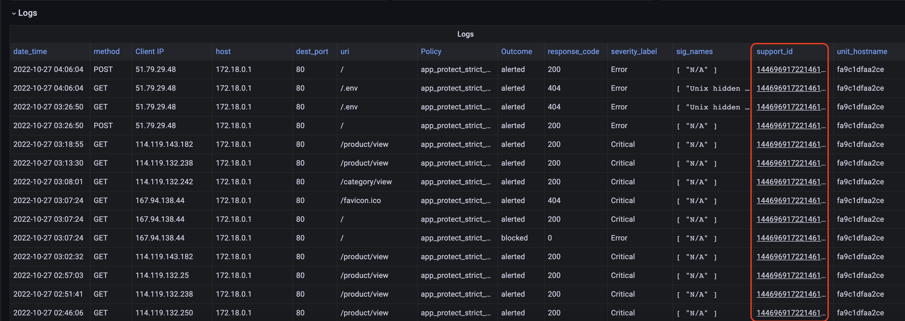
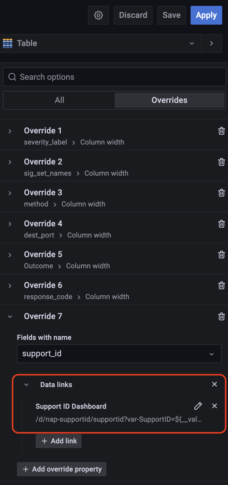

# NAP - Policy Management Installation
In the following section we will describe how to deploy all the required components in order for **NAP-False-Positive-Management** and **NAP-Policy-Editor** to work successfully. 

### Step 1. Deploy Elasticsearch to store NAP events (required only for False Positive Management)
**NAP-FPM** provides doesn't provide any Datastore to save *NGINX App Protect* events. For storing the NAP events we rely on Elasticsearch. Please refer to the <a href="https://github.com/f5devcentral/nap-policy-management#nap-dashboard"> NAP-Dashboard </a> project that provides all the details on how to deploy `Elasticsearch`, `Logstash` and `Grafana` for *NGINX App Protect*.

### Step2. Configure Git
The source of truth for the *NGINX App Protect* policies should always be Git. The Git repository should hold the latest version of the **WAF** policies that have been deployed. 
Currently we support 2 Git solutions:
- **Gitlab self-managed**. If you require information on how to install a self-managed GitLab instance, please refer to the following link. https://about.gitlab.com/install/
- **Gitea**. If you require information on how to install a self-managed Gitea instance, please refer to the following link. https://docs.gitea.io/en-us/

***PS: If you require another Git solution, please open a GitHub issue***

Once Git is up and running, **NAP-FPM** will use Git's API to pull and push changes made on the *NGINX App Protect* policies. 

**GitLab**
In order for **NAP-FPM** to have permission to save the policies to GitLab, we need to create a GITLAB Access-Token. This can be done under `Settings`->`Access Tokens` for the repository that holds the policies. The token needs to have read/write access to the repository.

<p align="center">
       
</p>

**Gitea**
In order for **NAP-FPM** to have permission to save the policies to GitLab, we need to create a GITEA Access-Token. This can be done under `Settings`->`Applications` for the repository that holds the policies.

<p align="center">
       
</p>

>**Note:**  Please keep the Access token as we will need to use it when we configure **NAP-FPM**.


### Step 3. Deploy NAP-Policy-Management docker image.

1. Clone the repo to your docker station and switch the working directory to be `nap-false-positive`.
   ```
   git clone https://github.com/f5devcentral/nap-policy-management
   cd nap-policy-management/npm
   ```
2.  Copy your NGINX Plus license to the current diretory `npm`. This is required, as during the build process we will download the NGINX NAP policy converter from the NGINX repository. 
   ```
   cp <location of nginx-repo.crt> .
   cp <location of nginx-repo.key> .
   ```
2.  Create a Volume for persistent storage. 
   ```
   docker volume create fpm-volume
   ```
3. Build the docker image.
   ```
   docker build -t nap-policy-management:latest .
   ```
4. Run the image that you just built.
   ```
   docker run -d -p 80:80 -v fpm-volume:/etc/fpm  nap-policy-management:latest
   ```

> Note: If you require **NAP-Policy-Management** to run inside K8s please open a GitHub issue for the instructions.


Ready to connect.


## Configuration
In this section we will take you through the steps on how to do the basic configuration of **NAP-FPM**.

Open your browser and connect to the IP address of the running container  

<p align="center">
       
</p>

Log in with the default credentials (admin/admin) and you should be redirect you to the `settings.php` page.

<p align="center">
       
</p>

> **Note:** You should see 2 warnings at the top of the page. This is due to the fact that neither GitLab nor Elastic datasources have been configured

Enter the URL for Elastic Datasource.

<p align="center">
       
</p>

> **Note:** After you have validate the Datasource URL, you should be able to save the configuration. 

Save Elastic Datasource. 

<p align="center">
       
</p>

> **Note:** You will receive a message that the Datasource configuration has been saved.


Click the `Add new` button and enter the Git details. 

<p align="center">

</p>

> **Note:** In case the policy are not on the root folder, enter the Foder/Path that the NAP Policies are saved.
> **Note2:** After you have validate the Datasource URL, you should be able to save the configuration. 

Save the GitLab Repo. 

<p align="center">
       
</p>

> **Note:** You will receive a message that the Datasource configuration has been saved.

Once all the above steps are completed you can go to the `Violations` tab. You should be able to retrieve the NAP events from and modify the configuration accordingly.


## Integration with Grafana
We are able to Grafana with NAP-FPM, so that the user can click the Support ID on Grafana and be redirected to NAP-FPM. To achieve this we need to edit the Logs Tab and change the datalink to point to NAP-FPM

<p align="left">
       
</p>

Once you are in edit mode, go to Overrides and change the datalink 

<p align="left">
       
</p>

From:
```
/d/nap-supportid/supportid?var-SupportID=${__value.raw}
```

To:
```
http://<IP-Address>/violation.php?support_id=${__data.fields["Support ID"]}
```

Once the change has been completed, you should be able to select the Support-ID and be automatically redirected to the FPM violations page.

<p align="left">
       
</p>


## Support
For support, please open a GitHub issue. Note, the code in this repository is community supported and is not supported by F5 Networks.


### Community Code of Conduct
Please refer to the [F5 DevCentral Community Code of Conduct](code_of_conduct.md).

### License
[Apache License 2.0](LICENSE)

### Copyright
Copyright 2014-2023 F5 Networks Inc.
 

### F5 Networks Contributor License Agreement

Before you start contributing to any project sponsored by F5 Networks, Inc. (F5) on GitHub, you will need to sign a Contributor License Agreement (CLA).

If you are signing as an individual, we recommend that you talk to your employer (if applicable) before signing the CLA since some employment agreements may have restrictions on your contributions to other projects.
Otherwise by submitting a CLA you represent that you are legally entitled to grant the licenses recited therein.

If your employer has rights to intellectual property that you create, such as your contributions, you represent that you have received permission to make contributions on behalf of that employer, that your employer has waived such rights for your contributions, or that your employer has executed a separate CLA with F5.

If you are signing on behalf of a company, you represent that you are legally entitled to grant the license recited therein.

You represent further that each employee of the entity that submits contributions is authorized to submit such contributions on behalf of the entity pursuant to the CLA.
